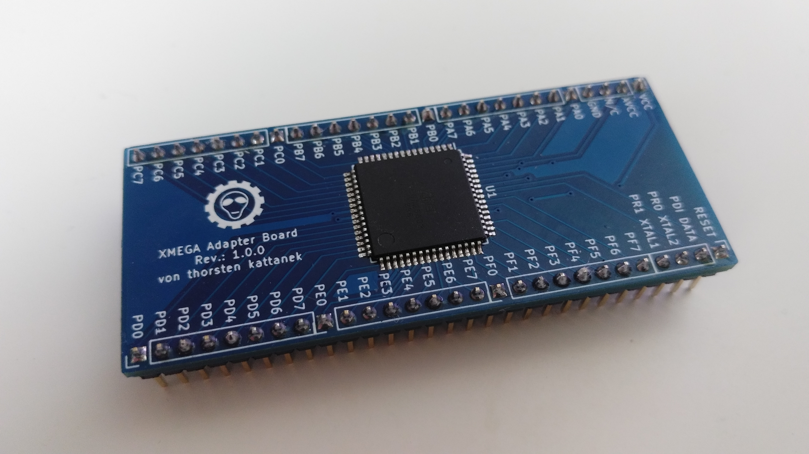
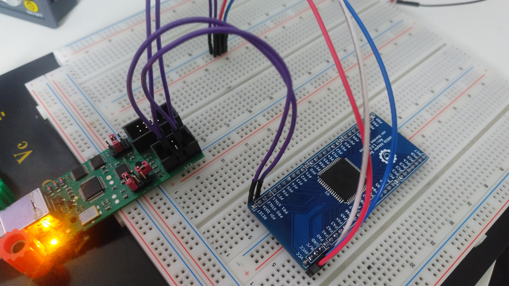

# XMEGA Adapter Board
Eine Adapter Platine für den XMEGA, um ihn auf dem Steckbrett zu nutzen.

## Fotos

## Anschluss und Programmiergerät

Das Board muss an VCC und AVCC mit 3,3V verbunden werden sowie GND mit Masse.  Ich verwende als Programmieragerät den AVR Programmer von Diamex. (Atmel AVRISP MKII kompatibel)
[https://www.diamex.de/dxshop/Diamex-AVR-Prog-Programmer-fuer-ISP-PDI-TPI](https://www.diamex.de/dxshop/Diamex-AVR-Prog-Programmer-fuer-ISP-PDI-TPI)  
Der XMEGA wird lediglich über 2 Leitungen mit den Programmiergerät verbunden. (PDI_CLK und PDI_DATA) Die Kommunikation erfolgt über PDI.

## Erste Schritte mit AVRDUDE und den XMEGA
### 1. avrdude -c avrispmkII -p x256d3 
Wenn alles richtig angeschlossen wurde sollte als Device ID 0x1e9844 ausgegeben werden.

